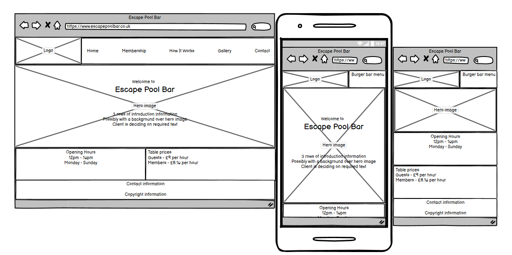
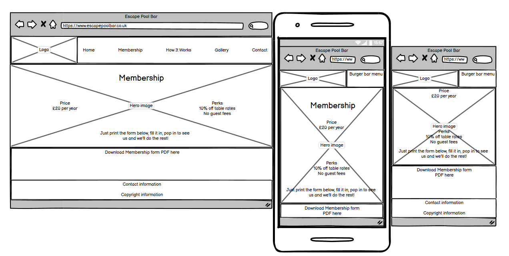
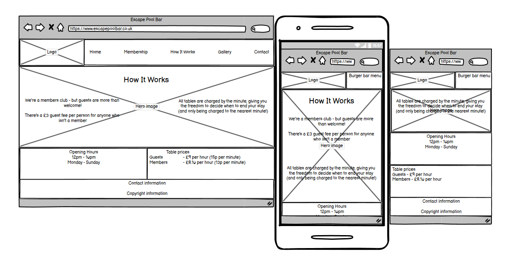
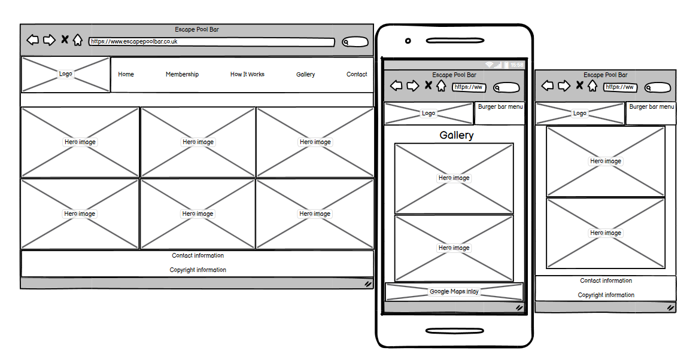
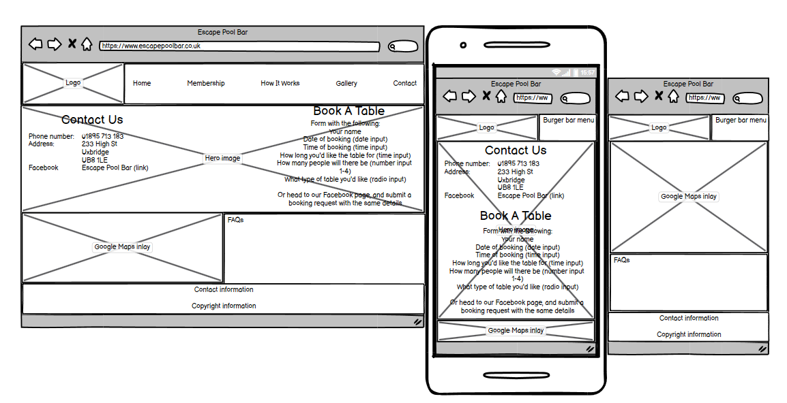
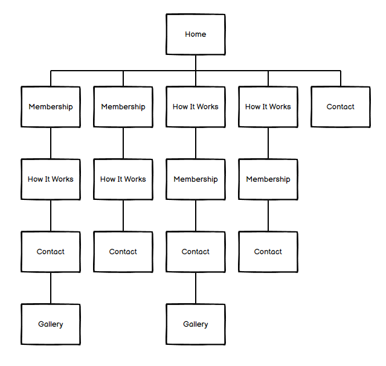

<h1 align="center">Escape Pool Bar Website</h1>

[Here is a link to the final project](https://abibubble.github.io/milestone1-escape-pool-bar/index.html)

This is the website for Escape Pool Bar, designed to be responsive and accessible on a range of devices, making it easy to access any information that their customers could need.

<h2>Initial discussion</h2>

In the initial planning meeting with the bar manager of Escape Pool Bar, he requested a website that would easily provide information to customers.
The staff were spending a lot of time at the bar explaining the details of how their pool bar works to customers, which was wasting time that the staff could be doing other duties.

Their target demnographic is mainly male with an age range of 16 - 65 years old. 

The main information that customers ask for are as follows:
<ul>
<li>Pricing (table rates, guest fees)</li>
<li>How their table pricing works</li>
<li>Membership information</li>
<li>Deals and discounts</li>
<li>Parking</li>
<li>Opening hours</li>
<li>History of the building</li>
<li>Contact information</li>
<li>How to book a table</li>
</ul>

<h2>User Experience (UX)</h2>
<h3>User stories</h3>
<h4>First Time Visitor Goals</h4>
I want to easily learn more about the company.
I want to be able to easily navigate throughout the site to find information.
I want to locate their social media links to see their social media prescence.

<h4>Returning Visitor Goals</h4>
I want to find current information about Covid-19.
I want to find the best way to get in contact with the organisation with any questions I may have.

<h4>Frequent User Goals</h4>
I want to find current information about Covid-19.
I want to submit a booking request.

<h2>Design</h2>
<h3>Colour Scheme</h3>
The main colours used are white and green, to correlate with English Pool colours (green cloth, white cue ball).

<h3>Typography</h3>
The Poppins font is the main font used throughout the whole website with Sans Serif as the fallback font in case the Poppins font isn't being imported into the site correctly.

<h3>Imagery</h3>
The large background hero image is designed to be striking and catch the user's attention, making it clear at first glance what the company does. It has a modern aesthetic, and directly correlates to the company.

<h3>Wireframes</h3>
<h4>Homepage Wireframe</h4>

<h4>Membership Wireframe</h4>

<h4>How It Works Wireframe</h4>

<h4>Gallery Wireframe</h4>

<h4>Contact Us Wireframe</h4>

<h4>User Navigation Map</h4>

<h3>Features</h3>
<ul>
<li>Text information</li>
<li>Images</li>
<li>PDF download</li>
<li>Embedded Google Maps box</li>
<li>Images carousel</li>
<li>Responsive on all device sizes</li>
</ul>

<h2>Technologies Used</h2>
<h3>Languages Used</h3>
HTML5
CSS3

<h3>Frameworks, Libraries & Programs Used</h3>
<h4>Bootstrap 4.5.2:</h4>
Bootstrap was used to help with the responsiveness and styling of the website.
<h4>Hover.css:</h4>
Hover.css was used on the Social Media icons in the footer to add the float transition while being hovered over.
<h4>Google Fonts:</h4>
Google fonts was used to import the 'Poppins' font into the style.css file which is used on all pages throughout the project.
<h4>Google Maps:</h4>
Google maps embed code was used to add the map.
<h4>Font Awesome:</h4>
Font Awesome was used on all pages tto add social media icons and the copyright icon.
<h4>jQuery:</h4>
jQuery came with Bootstrap which makes the navbar responsive.
<h4>Git</h4>
Git was used for version control by utilizing the Gitpod terminal to commit to Git and Push to GitHub.
<h4>GitHub:</h4>
GitHub is used to store the projects code after being pushed from Git.
<h4>Balsamiq:</h4>
Balsamiq was used to create the wireframes during the design process.

<h2>Testing</h2>
The W3C Markup Validator and W3C CSS Validator Services were used to validate every page of the project to ensure there were no syntax errors in the project.
W3C Markup Validator - Results <--LINKS-->
W3C CSS Validator - Results <--LINKS-->

<h3>Testing User Stories from User Experience (UX) Section</h3> <--UPDATE THIS-->
<h4>First Time Visitor Goals</h4>
<em>I want to easily learn more about the company.</em>
Upon entering the site, users are greeted with a navigation bar that is clean and easy to read to take them to the information that they need.
Underneath this, there is a hero image of a game of pool, making it obvious at first glance what the website is for.
The user then has two options - click in the navbar to navigate to another page, or scroll down.
Scrolling down leads to more information about the company.

<em>I want to be able to easily navigate throughout the site to find information.</em>
At the top of each page there is a clean and easy to read navigation bar, with each link describing what the page they will end up at clearly.
The logo in the top left of each page also links to the homepage, following standard convention.

<em>I want to locate their social media links to see their social media prescence.</em>
In the footer of each page, 

<h4>Returning Visitor Goals</h4>
I want to find current information about Covid-19.
I want to find the best way to get in contact with the organisation with any questions I may have.

<h4>Frequent User Goals</h4>
I want to find current information about Covid-19.
I want to submit a booking request

Once the new visitor has read the About Us and What We Do text, they will notice the Why We are Loved So Much section.
The user can also scroll to the bottom of any page on the site to locate social media links in the footer.
At the bottom of the Contact Us page, the user is told underneath the form, that alternatively they can contact the organisation on social media which highlights the links to them.
Returning Visitor Goals
As a Returning Visitor, I want to find the new programming challenges or hackathons.

These are clearly shown in the banner message.
They will be directed to a page with another hero image and call to action.
As a Returning Visitor, I want to find the best way to get in contact with the organisation with any questions I may have.

The navigation bar clearly highlights the "Contact Us" Page.
Here they can fill out the form on the page or are told that alternatively they can message the organisation on social media.
The footer contains links to the organisations Facebook, Twitter and Instagram page as well as the organization's email.
Whichever link they click, it will be open up in a new tab to ensure the user can easily get back to the website.
The email button is set up to automatically open up your email app and autofill there email address in the "To" section.
As a Returning Visitor, I want to find the Facebook Group link so that I can join and interact with others in the community.

The Facebook Page can be found at the footer of every page and will open a new tab for the user and more information can be found on the Facebook page.
Alternatively, the user can scroll to the bottom of the Home page to find the Facebook Group redirect card and can easily join by clicking the "Join Now!" button which like any external link, will open in a new tab to ensure they can get back to the website easily.
If the user is on the "Our Favourites" page they will also be greeted with a call to action button to invite the user to the Facebook group. The user is incentivized as they are told there is a weekly favourite product posted in the group.
Frequent User Goals
As a Frequent User, I want to check to see if there are any newly added challenges or hackathons.

The user would already be comfortable with the website layout and can easily click the banner message.
As a Frequent User, I want to check to see if there are any new blog posts.

The user would already be comfortable with the website layout and can easily click the blog link
As a Frequent User, I want to sign up to the Newsletter so that I am emailed any major updates and/or changes to the website or organisation.

At the bottom of every page their is a footer which content is consistent throughout all pages.
To the right hand side of the footer the user can see "Subscribe to our Newsletter" and are prompted to Enter their email address.
There is a "Submit" button to the right hand side of the input field which is located close to the field and can easily be distinguished.

<h3>Further Testing</h3>
The Website was tested on Google Chrome, Internet Explorer, Microsoft Edge and Safari browsers.
The website was viewed on a variety of devices such as Desktop, Laptop, Amazon Fire tablet, OPPO Find X2 Lite, Samsung Galaxy A70, Samsung Galazy S9, and Samsung A20.
A large amount of testing was done to ensure that all pages were linking correctly.
Friends, family members, staff and customers were asked to review the site and documentation to point out any bugs and/or user experience issues.

<h3>Known Bugs</h3>
On mobile, the nav bar moves slightly behind the URL area upon scrolling down.

<h2>Credits</h2>
<h3>Code</h3>
Bootstrap4: Bootstrap Library used throughout to make site responsive using the Bootstrap Grid System.

<h3>Content</h3>
All content was written by the developer.

<h3>Media</h3>
Logo designed and created by Andrew Chubb, Owner of Escape Pool Bar.
All photos were taken by Conor Nye, Bar Manager at Escape Pool Bar.

<h3>Acknowledgements</h3>
<li>My mentor, Antonio Rodriguez, for continuous helpful feedback and support.</li>
<li>The team at Escape Pool Bar, for giving me the opportunity to create their website.</li>
<li>Eve Crabb and Tom Crabb, for their support and help through my learning.</li>
<li>JimLynx_lead on Slack, for his continuous support and guidance.</li>
<li>The team at Code Institute, for teaching me the necessary skills to create this site.</li>

Launch
Table of contents
Project status 
Sources
Other information
build status?
API reference??????????????